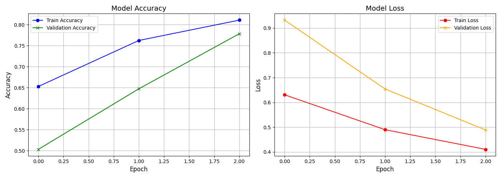

# Animal Detection Project Documentation

This project is designed to detect animals (cat, dog, and horse) in images using a deep learning model. It leverages TensorFlow and Keras to train a convolutional neural network (CNN) on a custom dataset, and outputs various useful files after training.

# How to start

### 1. **Pre-requirements**

Before you can run the project, you need to set up a virtual environment to manage dependencies.

#### Step 1: Create and Activate the Environment

```bash
python3 -m venv animal_detection_env
source animal_detection_env/bin/activate
```

#### Step 2: Install Dependencies

Once the environment is activated, install the required dependencies using the requirements.txt file.

```bash
pip install -r requirements.txt
```

If you need to remove your virtual env, you can run `deactivate`.

### **Adding the Dataset**

To train the model, you need to structure your dataset in a specific way. Follow the directory structure below:

```
dataset
  ├── train
  │   ├── cat.1.jpg
  │   ├── cat.2.jpg
  │   ├── dog.1.jpg
  │   ├── dog.2.jpg
  │   ├── horse.1.jpg
  │   ├── horse.2.jpg
  ├── validate
  │   ├── cat.1.jpg
  │   ├── cat.2.jpg
  │   ├── dog.1.jpg
  │   ├── dog.2.jpg
  │   ├── horse.1.jpg
  │   ├── horse.2.jpg
```

- Each folder under train and validate should contain images for that particular class (e.g., cat, dog, horse).
- The images should be named in the following format: {animalName}.{imageNumber}.{imageFormat}. For example: cat.1.jpg, dog.56.png.

### **Train the modal**

Once your dataset is correctly structured, you can start training the model by running the following command:

```bash
python main.py
```

Model Training Explanation:

- The script will read the images from the dataset, preprocess them, and then train a Convolutional Neural Network (CNN) to detect the animals.
- Training will run for a predefined number of epochs, and the model will be saved to the disk after completion.

### **Results and Outputs**

After running the training script, you will find the following outputs in the result folder:


- `training_plots.png`: This plot shows the accuracy and the loss curve during training of the model during training.

Plot for comparing the model accuracy and loss:


- `demo.mp4`: This is a video showing the model identifying animals in images. It gives a demonstration of how the trained model performs on unseen images. The video can be used to visually verify how well the model is identifying animals.

- `trained_model_history.pickle`: This file contains the history of the model training, including accuracy, loss values, and other metrics during training. It is saved as a Python pickle file, which can be loaded later for further analysis.

- `trained_model.h5`: This is the trained model's weights and architecture saved in the HDF5 format. You can load this model later for inference on new images without having to retrain it.
